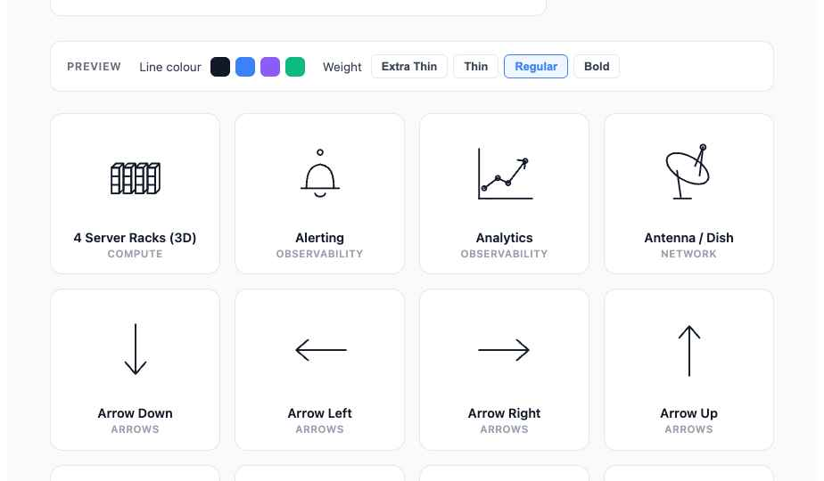
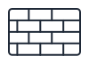

# Monoline ICT Icons

A monoline (single-weight outline) icon set for **ICT and solutions-architecture diagrams** — network, compute, cloud, data, security and more. The set ships as a [draw.io](https://www.drawio.com/) stencil library so you can drop icons onto a canvas and recolour them, plus standalone SVGs for use anywhere else.

Every icon is drawn as an **outline stencil**: the fill is always empty, and the shape follows the diagram's **Line** colour. Change the line colour (and stroke weight) in draw.io and the whole icon recolours to match.



## Contents

**59 icons** across 15 categories:

| Category | Count | Examples |
| --- | --- | --- |
| Network | 9 | Router, Switch, VPN, Firewall, Load Balancer, Wireless AP, CDN, Antenna / Dish, Cell Tower |
| Compute | 8 | Server (1 RU / 5 RU), Server Racks, CPU, RAM, Cloud Computing |
| Data | 6 | Database, Storage / NAS, Block Storage, Hard Drive, Cache, Queue System |
| Security | 6 | Firewall, VPN, Identity, Secure, Key, Certification Shield |
| Tools | 5 | Configuration Cog, Spanner, Pencil & Ruler, Magnifying Glass, Light Bulb |
| Arrows | 4 | Arrow Left / Right / Up / Down |
| Observability | 4 | Graphs, Analytics, Log Scrolls, Alerting |
| Business | 3 | Office Building, Office Space, Money |
| Devices | 3 | Laptop, Mobile Phone, Tablet |
| Facilities | 3 | Enterprise Office Building, Datacentre / Server Rack |
| Flow | 3 | Process, Task List, Folder |
| Cloud | 2 | Cloud, Internet / Globe |
| People | 1 | User |
| Software | 1 | Browser |
| Status | 1 | Check |

## Using the icons

### In draw.io

1. Open [draw.io](https://app.diagrams.net/) (web or desktop).
2. Go to **File ▸ Open Library from ▸ Device**.
3. Select [`ict-icons.drawio-library.xml`](ict-icons.drawio-library.xml).

The icons appear as a new shape palette in the left sidebar. Because each icon is a stencil that inherits its stroke, you recolour it by selecting the shape and changing the **Line** colour in the Style panel — the fill stays empty.

### As SVGs

The [`svg/`](svg/) directory contains all 59 icons as standalone `.svg` files. Each uses a `0 0 100 100` viewBox with `fill="none"` and a `stroke` colour, so you can restyle them with CSS or by editing the `stroke` / `stroke-width` attributes.

```html

```

## Interactive preview

[`index.html`](https://mcnamee.github.io/monoline-ict-icons/) is a live preview page that renders the full grid and lets you experiment with the **line colour** and **stroke weight** (Extra Thin → Bold) before importing. Open it in a browser to see the icons rendered from the shared source data.

## Project structure

| Path | Description |
| --- | --- |
| `ict-icons.drawio-library.xml` | The draw.io stencil library (importable). |
| `svg/` | 59 standalone SVG icons. |
| `icons-data.js` | Single source of truth — each icon defined as normalised primitives (`rect`, `line`, `circle`, `poly`, `path`, …) in a `0..100` coordinate space, plus an `iconToSVG()` renderer. |
| `index.html` | Interactive preview page. |
| `support.js` | Generated runtime for the preview component. |
| `screenshots/` | Preview screenshots. |

Icon geometry lives in `icons-data.js`. Both the SVG files and the draw.io stencils are generated from these definitions, so that file is the place to add or adjust an icon.
